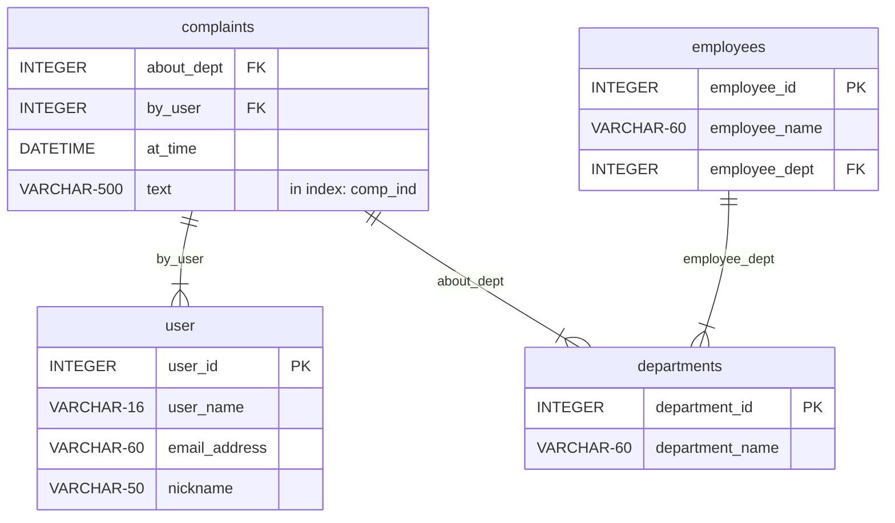

# sqlmermaid

[](https://sqlmermaid.readthedocs.io/en/latest)
[](https://codeclimate.com/github/endremborza/sqlmermaid)
[](https://codecov.io/gh/endremborza/sqlmermaid)
[](https://pypi.org/project/sqlmermaid/)

Creates pretty schema diagrams like this one, simply from a constring

```{mermaid}
   erDiagram
     complaints {    
       INTEGER about_dept FK     
       INTEGER by_user FK     
       DATETIME at_time      
       VARCHAR-500 text  "in index: comp_ind"
     }
     departments {    
       INTEGER department_id PK     
       VARCHAR-60 department_name  
     }
     user {    
       INTEGER user_id PK     
       VARCHAR-16 user_name      
       VARCHAR-60 email_address      
       VARCHAR-50 nickname  
     }
     employees {    
       INTEGER employee_id PK     
       VARCHAR-60 employee_name      
       INTEGER employee_dept FK 
     }
     complaints ||--|{ user : "by_user"
     complaints ||--|{ departments : "about_dept"
     employees ||--|{ departments : "employee_dept"
```


